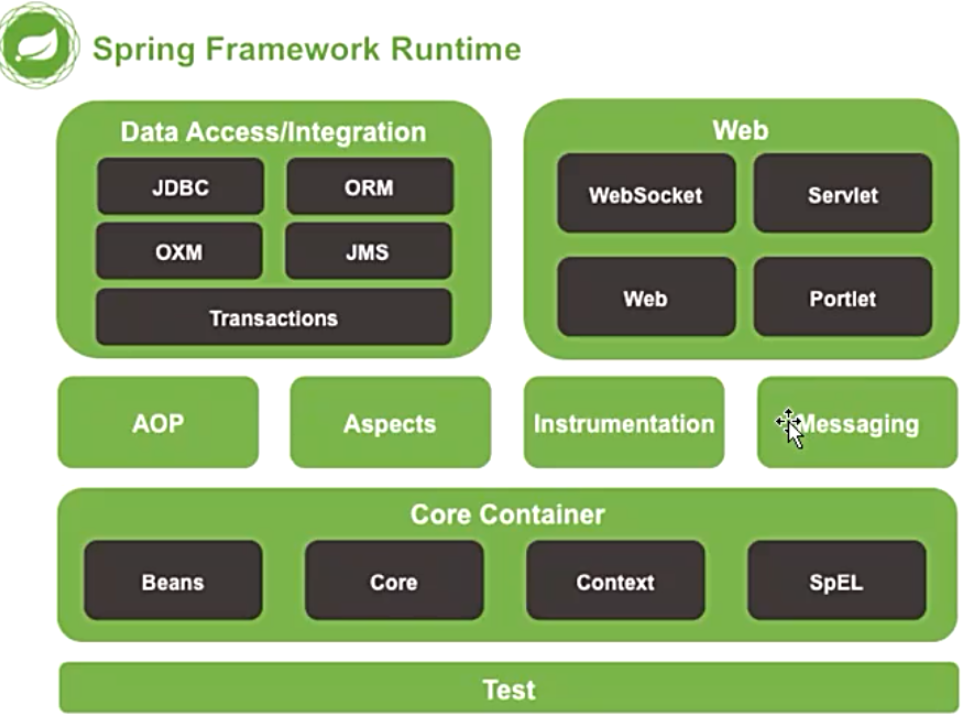
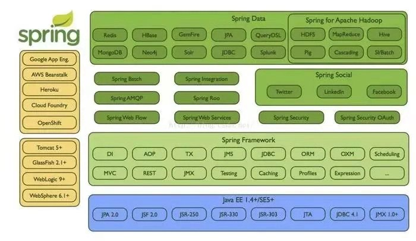

# spring4.0学习

# spring旗下各个顶级项目

##第一章 Spring 基础

---

##第二章 Spring 常用配置
###2.1 Bean 的 Scope
* @Scope("singleton") 单例  默认值
* @Scope("protorype") 多列

###2.2 Spring EL 和资源调用
* @Value
* 注入普通字符串
* 注入操作系统属性
* 注入表达式结果
* 注入其他 Bean 属性
* 注入文件资源
* 注入网址资源
* 注入配置文件

###2.3 Bean 的初始化和销毁
* Java 配置方法：使用 @Bean 的 initMethod 和 destoryMethod （相当于 xml 配置的 init-method 和 destory-method）
* 注解方式：利用 JSR-250 的 @PostConstruct 和 @PreDestroy

###2.4 Profile
* 通过设定 Environment 的ActiveProfiles 来设定当前 context 需要使用的配置环境, 在开发中使用 @Profile 注解类或者方法, 达到在不同情况下选择实例化不同的Bean
* 通过设定 jvm 的spring.profiles.active 参数来设置配置环境
* Web 项目设置在 Servlet 的 context parameter 中

###2.5 事件 (Application Event)
Spring 的事件 (Application Event) 为 Bean 与 Bean 之间的消息通信提供了支持, 当一个 Bean 处理完一个任务之后, 希望另一个 Bean 知道并能做相应的处理,这时我们就需要让另一个 Bean 监听当前 Bean 所发送的事件
Spring 的事件需要遵循如下流程
1. 自定义事件, 集成 ApplicationEvent
2. 定义事件监听器, 实现 ApplicationListener
3. 使用容器发布事件

---
   
###第三章 Spring 高级话题
#### 3.1 Spring Aware
使用 Spring Aware 让你的 Bean 和 Spring 框架耦合

| 名称        | 作用           |
| ------------- |:-------------:|
|BeanNameAware  |获取到容器中的 Bean 的名称|
|BeanFactoryAware|获取当前 bean factory, 这样可以调用容器的服务|
|ApplicationContextAware*|当前的 application context， 这样可以调用容器的服务|
|MessageSourceAware|获得 message source, 这样可以获取文本信息|
|ApplicationEventPublisherAware|应用事件发布器, 可以发布事件|
|ResourceLoaderAware|获取资源加载器, 可以获得外部资源文件|

#### 3.2 多线程
Spring 通过任务执行器 (TaskExecutor) 来实现多线程和并发编程. 
使用 ThreadPoolTaskExecutor 可实现一个基于线程的 TaskExecutor. 
在配置类中通过@EnableAsync 开启对异步任务的支持, 
并通过在实际执行的 Bean 的方法中使用@Async 注解来声明其是一个异步任务

#### 3.3 计划任务
* 对计划任务提供支持
* 使用 @EnableScheduling 开启计划任务支持
* 使用 @Scheduled 来注解计划任务的方法

#### 3.4 条件注解 @Conditional

#### 3.5 组合注解与元注解

##### 自定义注解
使用@interface自定义注解时，自动继承了java.lang.annotation.Annotation接口，
由编译程序自动完成其他细节。在定义注解时，不能继承其他的注解或接口。
@interface用来声明一个注解，其中的每一个方法实际上是声明了一个配置参数。
方法的名称就是参数的名称，返回值类型就是参数的类型（返回值类型只能是基本类型、Class、String、enum）。
可以通过default来声明参数的默认值。
* 定义注解格式
 ```public @interface 注解名 {定义体} ```

##### 一、组合注解
组合注解这个就比较好理解了，就是将多个注解组合到一块生成一个新的注解。
使用这个新的注解就相当于使用了该组合注解中所有的注解。

##### 二、元注解

* 注解参数的可支持数据类型：
所有基本数据类型（int,float,boolean,byte,double,char,long,short)
String类型
Class类型
enum类型
Annotation类型
以上所有类型的数组

* 常用注解有：
@Override 表示重写一个方法
@Deprecated 被此注解标记过的方法表示该方法以及过时，不想在被别人使用
@SuppressWarning 压制程序中的警告

* @Retention: 被保留的时间长短，注解的保留位置
@Retention(RetentionPolicy.SOURCE)   //注解仅存在于源码中，在class字节码文件中不包含
@Retention(RetentionPolicy.CLASS)    // 默认的保留策略，注解会在class字节码文件中存在，但运行时无法获得，
@Retention(RetentionPolicy.RUNTIME)  // 注解会在class字节码文件中存在，在运行时可以通过反射获取到

* @Target：所修饰的对象范围 
@Target(ElementType.TYPE)                             //接口、类、枚举、注解
@Target(ElementType.FIELD)                            //字段、枚举的常量
@Target(ElementType.METHOD)                           //方法
@Target(ElementType.PARAMETER)                        //方法参数
@Target(ElementType.CONSTRUCTOR)                      //构造函数
@Target(ElementType.LOCAL_VARIABLE)                   //局部变量
@Target(ElementType.ANNOTATION_TYPE)                  //注解
@Target(ElementType.PACKAGE)                          //包    

* @Document：说明该注解将被包含在javadoc中

* @Inherited：说明子类可以继承父类中的该注解
 
* @PathVariable注解:
@PathVariable("xxx")
通过 @PathVariable 可以将URL中占位符参数{xxx}绑定到处理器类的方法形参中@PathVariable(“xxx“) 
@RequestMapping(value=”user/{id}/{name}”)
请求路径：http://localhost:8080/hello/show5/1/james
————————————————

#### 3.6 @Enable* 注解的工作原理

##### 第一部分
* @EnableAspectJAutoProxy 开启对 AspectJ 自动代理的支持
* @EnableAsync 开启异步方法的支持
* @EnableScheduling 开启计划任务的支持
* @EnableWebMvc：开启Web Mvc配置功能
   
##### 第二部分
* @EnableWebMvc 开启 Web MVC 的配置支持
   
##### 第三部分
* @EnableConfigurationProperties 开启对 @ConfigurationProperties 注解配置 Bean 的支持
* @EnableJpaRepositories 开启对 Spring Data JPA Repository 的支持
* @EnableTransactionManagement 开启注解式事务的支持
* @EnableCaching 开启注解式的缓存支持
    
所有的@Enable*注解都有一个@Import 注解    
1. 直接导入配置类
2. 依据条件选择配置类
3. 动态注册 Bean

JSR303定义的校验类型

空检查
@Null			验证对象是否为null
@NotNull		验证对象是否不为null, 无法查检长度为0的字符串
@NotBlank		检查约束字符串是不是Null还有被Trim的长度是否大于0,只对字符串,且会去掉前后空格.
@NotEmpty		检查约束元素是否为NULL或者是EMPTY. 

Booelan检查
@AssertTrue		验证 Boolean 对象是否为 true  
@AssertFalse	验证 Boolean 对象是否为 false  

长度检查
@Size(min=, max=)		验证对象（Array,Collection,Map,String）长度是否在给定的范围之内  
@Length(min=, max=)		验证注解的元素值长度在min和max区间内

日期检查
@Past		验证 Date 和 Calendar 对象是否在当前时间之前  
@Future		验证 Date 和 Calendar 对象是否在当前时间之后  
@Pattern	验证 String 对象是否符合正则表达式的规则

数值检查，建议使用在Stirng,Integer类型，不建议使用在int类型上，因为表单值为“”时无法转换为int，但可以转换为Stirng为"",Integer为null
@Min			验证 Number 和 String 对象是否大等于指定的值  
@Max			验证 Number 和 String 对象是否小等于指定的值  
@DecimalMax		被标注的值必须不大于约束中指定的最大值. 这个约束的参数是一个通过BigDecimal定义的最大值的字符串表示.小数存在精度
@DecimalMin		被标注的值必须不小于约束中指定的最小值. 这个约束的参数是一个通过BigDecimal定义的最小值的字符串表示.小数存在精度
@Digits			验证 Number 和 String 的构成是否合法  
@Digits(integer=,fraction=)		验证字符串是否是符合指定格式的数字，interger指定整数精度，fraction指定小数精度。

@Range(min=, max=)	验证注解的元素值在最小值和最大值之间
@Range(min=10000,max=50000,message="range.bean.wage")
private BigDecimal wage;

@Valid 递归的对关联对象进行校验, 如果关联对象是个集合或者数组,那么对其中的元素进行递归校验,如果是一个map,则对其中的值部分进行校验.(是否进行递归验证)
@CreditCardNumber信用卡验证
@Email  验证是否是邮件地址，如果为null,不进行验证，算通过验证。
@ScriptAssert(lang= ,script=, alias=)
@URL(protocol=,host=, port=,regexp=, flags=)
————————————————
   
#### 3.7 测试